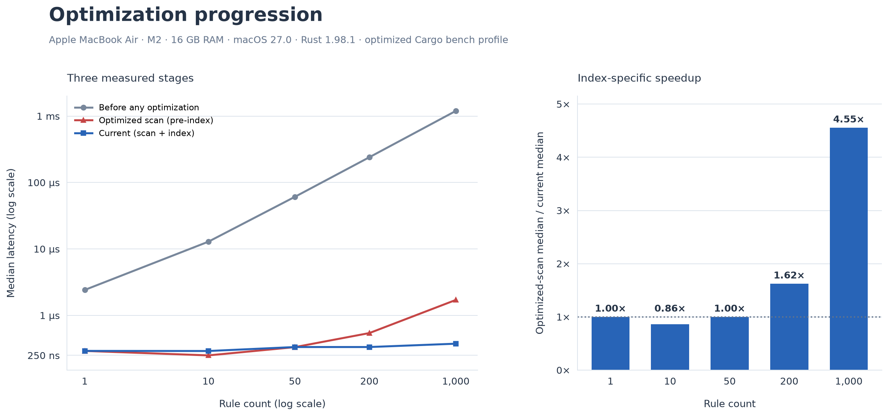

# Policy-check benchmarks

This measures the cost of a single `Nitera::check()` call. The request used is a filesystem `read` that matches the *last* rule in the policy, close to the worst case for a linear scan.

`check()` resolves through two paths depending on the policy:

- **Linear scan**: used for small or unselective rule sets.
- **Sorted prefix index**: used once a rule list has at least 64 rules, at least 8 distinct literal prefixes, and no more than 16 distinct prefix lengths. Below that, it falls back to the scan. Each of `deny`, `ask`, and `allow` gets its own index; process scopes reuse the same lookup. See [Index behavior](#index-behavior).

Every number in this document is from the same machine: **Apple MacBook Air, M2, 16 GB RAM, macOS 27.0, Rust 1.98.1, optimized Cargo bench profile.**

## Method

- Harness: [`benches/policy_check.rs`](./benches/policy_check.rs), unchanged across every measurement below. It builds `N` non-matching rules plus one matching rule, runs 1,000 warmup calls, then 100,000 individually-timed calls, and reports median/p95/p99 from the sorted sample set. Loading and request construction happen outside the timed region.
- This document's `rule_count` label excludes the final matching rule, so `rule_count=200` means 201 total rules in the policy. The index's 64-rule threshold is stated in total rules, which is 63 in this `rule_count` convention.
- Reproduce with:

```bash
cargo bench --bench policy_check
```

## Current results

| Rules in policy | Median | p95 | p99 |
|---|---|---|---|
| 1 | 292 ns | 334 ns | 541 ns |
| 10 | 291 ns | 333 ns | 416 ns |
| 50 | 334 ns | 375 ns | 500 ns |
| 200 | 334 ns | 375 ns | 500 ns |
| 1000 | 375 ns | 417 ns | 500 ns |

The 1, 10, and 50-rule rows sit below the index's activation threshold and are pure linear scan. The 200- and 1000-rule rows are past it and use the index. Median latency stays within a 292-375 ns band across the entire tested range, rather than growing with rule count the way the pre-index implementation did.

## What indexing changed

| Rules in policy | Optimized scan (pre-index) | Current (scan + index) | Change |
|---|---|---|---|
| 1 | 292 ns | 292 ns | 0% (below threshold) |
| 10 | 250 ns | 291 ns | +16% (below threshold, within measurement noise) |
| 50 | 333 ns | 334 ns | +0.3% (below threshold) |
| 200 | 542 ns | 334 ns | -38% (1.62x) |
| 1000 | 1,708 ns | 375 ns | -78% (4.55x) |

Below the threshold, the numbers are unchanged or within noise, expected, since the index isn't engaged there. Past it, the win grows with rule count: 1.62x at 200 rules, 4.55x at 1000. (An earlier self-reported measurement from the PR that introduced indexing, on different hardware, put these two figures at 1.80x and 5.98x; the table above is the verified figure on this project's own machine and supersedes that estimate.)

Against the numbers from before any optimization work (the original release build), the cumulative improvement at 1000 rules is about 3,188x (1,195,625 ns down to 375 ns).

## Index behavior

Rules are sorted by literal prefix, with order preserved within each prefix group; the first rule in a list is left in place for a cheap early-match check. A lookup checks the relevant prefix lengths, binary-searches the matching groups, then runs every candidate through the existing path matcher, so a matching rule is never skipped by the index, only located faster. Rules with an empty prefix (e.g. `/**/private`) remain candidates in every lookup. Broad wildcard groups can still require scanning many candidates within a group, so the index does not guarantee logarithmic lookup for every policy shape. `HOME`-relative rules are still resolved through the original evaluator rather than the index.

## Earlier history (same machine)

For context, the two stages that came before indexing, also all on this M2 machine:

**Dev vs. release build**, before any of the optimization work below:

| Rules in policy | Dev median | Release median | Speedup |
|---|---|---|---|
| 1 | 7,708 ns | 2,417 ns | 3.19x |
| 10 | 41,541 ns | 12,875 ns | 3.23x |
| 50 | 192,542 ns | 60,917 ns | 3.16x |
| 200 | 756,916 ns | 240,250 ns | 3.15x |
| 1000 | 3,771,791 ns | 1,195,625 ns | 3.15x |

**Constant-factor scan optimization**, release build, before indexing existed:

| Rules in policy | Before | After | Speedup |
|---|---|---|---|
| 1 | 2,417 ns | 292 ns | 8.28x |
| 10 | 12,875 ns | 250 ns | 51.5x |
| 50 | 60,917 ns | 333 ns | 182.9x |
| 200 | 240,250 ns | 542 ns | 443.3x |
| 1000 | 1,195,625 ns | 1,708 ns | 700.0x |

## Charts

### 1. Latency vs. rule count, current


Below the dotted threshold line, points are the scan (red); at and above it, they're the index (blue). Latency barely moves across the full 1-to-1000-rule range now, 292 ns to 375 ns.

### 2. Percentiles by policy size, current


All three percentiles across all five policy sizes fit inside a 292-541 ns band.

### 3. Per-rule cost, current


Median divided by rule count. Falls from 292 ns/rule at n=1 to 0.375 ns/rule at n=1000, since total latency is now nearly constant while rule count keeps growing, the opposite shape from a linear scan, where this ratio converges to a nonzero constant.

### 4. Three-stage progression



Left: before any optimization, after the constant-factor scan optimization, and current, all on this machine, log-scaled since the range spans 250 ns to 1.2 ms. Right: the speedup contributed specifically by indexing (current vs. the optimized-scan stage). The dotted line at 1.0x marks no change; bars below it (n=10) are within measurement noise, not a regression.

## Limits

- Very small measurements (a few hundred nanoseconds) are sensitive to timer resolution and OS scheduling; the +16% at n=10 in "What indexing changed" is most likely noise rather than a real effect, since that policy size is below the index threshold and nothing in the code path for it changed.
- This isolates `check()` itself, not the cost of the real read/write/delete call it authorizes.
- The harness covers one workload shape: a last-match filesystem read. Other rule shapes (early matches, misses, shared prefixes, exact paths, broad globs) aren't covered by the numbers above.
- Load time and memory overhead from building the index haven't been independently re-measured on this machine; the only figures available are self-reported by the indexing PR on different hardware, so they're left out of this document rather than mixed in.
- Single machine, single measurement session per stage. All figures are on macOS; other platforms would need their own runs.
