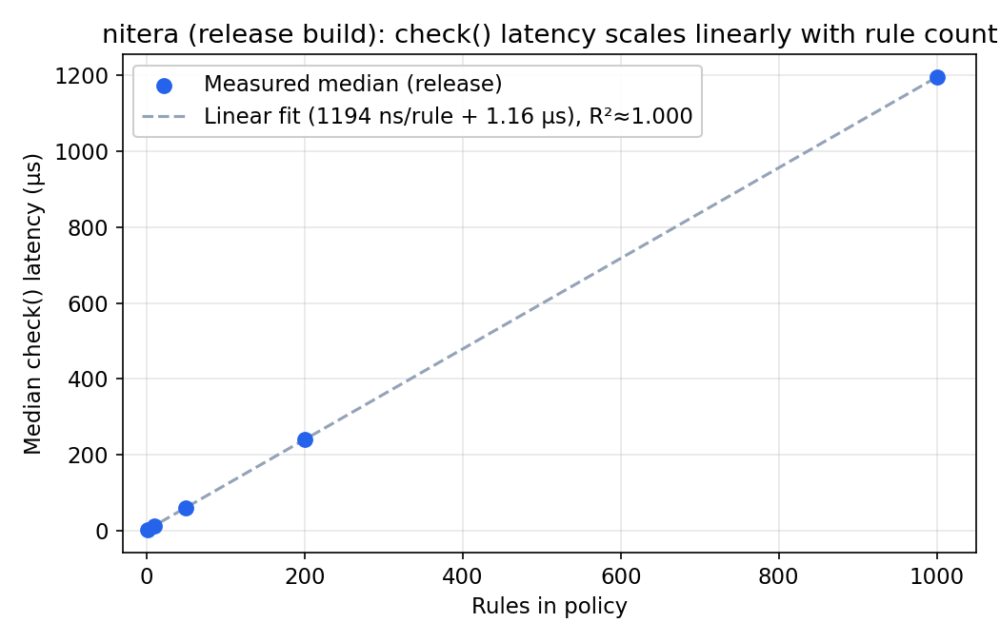
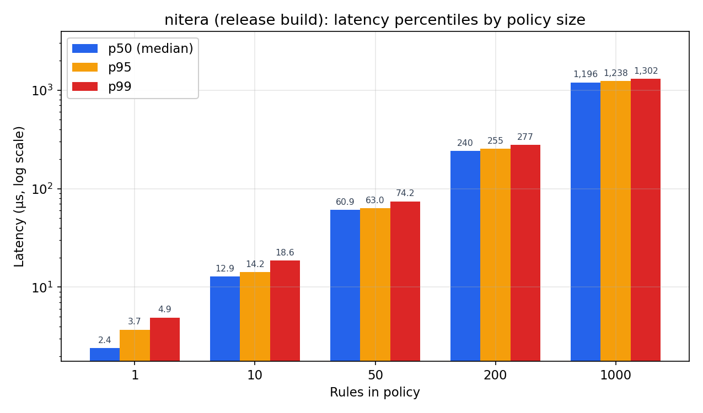
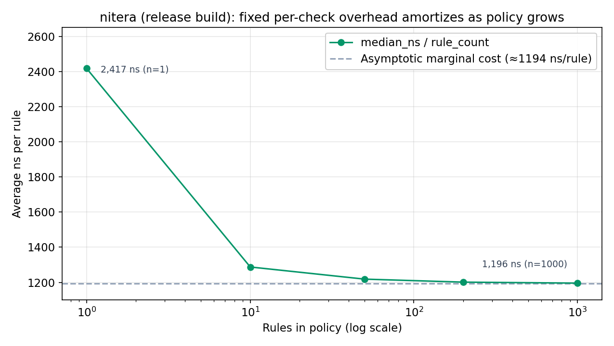
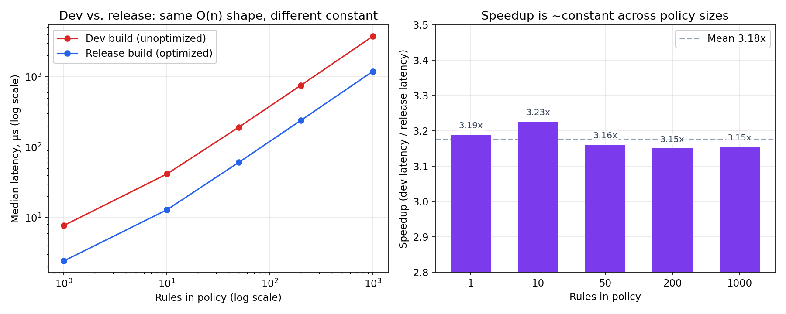

# Benchmarks

This measures the cost of a single `Nitera::check()` call as the number of rules in a policy grows. The request used is a filesystem `read` that matches the *last* rule in the policy, which is close to the worst case for the current linear scan.

## The short version

For a typical policy (a handful to a few dozen rules), `check()` costs somewhere between 2 and 60 microseconds in a release build. That's fast enough to disappear next to the actual filesystem call it's guarding.

Even at the extreme end tested here, a 1000-rule policy, a single check costs about 1.2 milliseconds. That's still comfortably fast for a one-off decision (approving a command, gating a write). It would only start to matter if `check()` sat inside a tight loop over many operations, since the underlying algorithm is still a linear scan through the rule list, it's just a much faster linear scan now.

Optimized builds are consistently about 3.18x faster than debug builds across every policy size tested (3.15x to 3.23x, barely varies). That consistency is itself informative: the compiler is speeding up each iteration of the same scan uniformly, not changing its algorithmic shape. The O(n) behavior is unchanged, only the constant factor improved.

## Method

- Hardware: Apple MacBook Air, M2, 16 GB RAM
- Source: [`benches/policy_check.rs`](./benches/policy_check.rs), wired up as a Cargo bench target with a custom harness:

```toml
# Cargo.toml
[[bench]]
name = "policy_check"
harness = false
```

  `harness = false` tells Cargo not to look for `#[bench]`-attributed functions and just run `main()` directly, while still using Cargo's optimized bench profile (equivalent to `--release` by default). This is the standard way to run a hand-rolled benchmark on stable Rust without pulling in a dependency.
- Two builds were measured: a dev build (`cargo run`, unoptimized + debuginfo) and a release-optimized build (`cargo bench`, or equivalently `cargo run --release`). All numbers in the Results table below are the release build; the dev numbers are kept only for the comparison chart.
- For each rule count (1, 10, 50, 200, 1000): a `.nitera` policy is generated with `N` non-matching `allow read` rules followed by one matching rule, then `check()` is called 100,000 times (after a 1,000-call warmup) against a request for the matching path
- Reported: median, p95, and p99 latency in nanoseconds, from the sorted sample set

To reproduce:

```bash
cargo bench --bench policy_check
```

## Results (release build)

| Rules in policy | Median | p95 | p99 |
|---|---|---|---|
| 1 | 2,417 ns (2.42 µs) | 3,709 ns (3.71 µs) | 4,917 ns (4.92 µs) |
| 10 | 12,875 ns (12.88 µs) | 14,208 ns (14.21 µs) | 18,583 ns (18.58 µs) |
| 50 | 60,917 ns (60.92 µs) | 63,000 ns (63.00 µs) | 74,209 ns (74.21 µs) |
| 200 | 240,250 ns (240.25 µs) | 254,833 ns (254.83 µs) | 277,125 ns (277.13 µs) |
| 1000 | 1,195,625 ns (1.20 ms) | 1,237,875 ns (1.24 ms) | 1,302,250 ns (1.30 ms) |

A linear fit against this data gives `median_ns ≈ 1,194.5 × rule_count + 1,164.8`, with R² of essentially 1.0 (five points, almost exactly colinear).

## Dev vs. release

| Rules in policy | Dev median | Release median | Speedup |
|---|---|---|---|
| 1 | 7,708 ns | 2,417 ns | 3.19x |
| 10 | 41,541 ns | 12,875 ns | 3.23x |
| 50 | 192,542 ns | 60,917 ns | 3.16x |
| 200 | 756,916 ns | 240,250 ns | 3.15x |
| 1000 | 3,771,791 ns | 1,195,625 ns | 3.15x |

Mean speedup 3.18x, standard deviation 0.03x across all five sizes. The dev-profile fit was `median_ns ≈ 3,767.9 × rule_count + 3,845.0`, also R² ≈ 1.0.

## Charts

### 1. Latency vs. rule count (release)



Median latency plotted against rule count, with a fitted trend line. The five measured points sit almost exactly on the line (`1,194.5 ns × rule_count + 1,164.8 ns`, R² ≈ 1.000), confirming `check()` is still O(n) after optimization, the compiler made each step of the scan cheaper, it didn't change the shape of the curve. Exact per-size numbers are in the Results table above rather than on the chart itself, to keep the low end (1, 10, 50 rules) readable next to the 1000-rule point.

### 2. Percentiles by policy size (release)



Median, p95, and p99 for each rule count, log y-axis since the range spans roughly 500x. The tail stays proportionally tight throughout: at 1 rule, p99 is about double the median (largely fixed overhead noise at that scale), but by 50+ rules p99 sits only 10-20% above the median. The scan itself is consistent, most of the tail variance comes from the fixed per-call overhead, not from the scan getting unpredictable as it gets longer.

### 3. Per-rule cost, amortized (release)



Median latency divided by rule count, at each size. At 1 rule it's 2,417 ns since that single check absorbs the entire fixed overhead. By 1000 rules it's down to 1,196 ns, essentially identical to the fitted marginal cost of 1,194.5 ns/rule from chart 1. The gap, about 1,165 ns, is the fixed cost of a `check()` call that has nothing to do with rule count: request setup, whatever happens once per call regardless of policy size. Only the first and last points are labeled here since the middle three (n=10, 50, 200) converge close enough together that individual labels would overlap; the curve shape itself carries the story.

### 4. Dev vs. release



Left: both builds plotted together on log-log axes, so the full 1 to 1000 rule range and roughly 500x latency range are both visible without either build's line being squeezed flat. The two lines run parallel, same slope in log-log space, which is what "same algorithmic shape, different constant" looks like visually. Right: the speedup factor at each individual rule count, zoomed into 2.8x-3.5x to make the near-constant behavior legible. It hovers in a tight 3.15x-3.23x band around the 3.18x mean, confirming the compiler's win here is uniform across policy sizes rather than concentrated at one end.

## What this means for real use

- **Small to medium policies (roughly 1-50 rules), which covers most real usage:** overhead is 2 to 61 microseconds per check in a release build. This is now clearly below the cost of a typical filesystem syscall, nitera will not be the bottleneck in normal use, not even close.
- **Large policies (hundreds to a thousand rules):** overhead is 0.24 to 1.2 milliseconds. Still fine for interactive, one-at-a-time decisions. Starts to matter only if checks run in a loop over many operations, since cost is per-call and linear in rule count.
- **Always benchmark and ship release builds.** The 3.18x gap here is a reminder that dev-profile numbers meaningfully understate real-world performance for CPU-bound work like this; anyone evaluating nitera (or any Rust crate) on latency should be looking at `--release` numbers, which is what's reported above.
- **Why it's still linear:** `check()` scans the rule list top to bottom looking for a match, with no indexing, in both builds. That hasn't changed, only how fast each step of the scan runs. It remains the natural place to look if a workload ever needs to push into the thousands of rules with checks in a hot path.

## Future work

- Indexing rules by path prefix (a trie or similar structure) instead of a flat scan, so lookup cost stops growing linearly with rule count
- Confirming whether glob patterns are compiled once at policy load time or re-parsed per check, and caching that if not
- Re-running this same benchmark after any such change, using the same methodology, for an actual before/after comparison against both the dev and release numbers recorded here

## Caveats

- Single machine, single run per rule count and per profile, not averaged across multiple runs or machines.
- This isolates `check()` itself, not the cost of the real read/write/delete call it guards. It shouldn't be read as "nitera adds this much to your filesystem calls," only as the policy-check portion of that.
- `black_box` prevents the compiler from optimizing the call away, but some scheduler jitter is still expected in the p95/p99 tails, most visible at the 1-rule size where the absolute numbers are smallest.